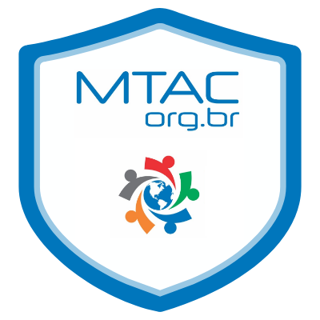

### Fala galera, sejam bem vindos ao meu perfil do GitHub 👋

Eu sou Cleiton Felipe de Moraes ou o Black Coder como está no meu canal.

- 🔭 Atualmente sou Engenheiro de Software na @GFT Brasil
- 👯 Estou sempre buscando maneiras de compartilhar conteúdos nas comunidades técnicas com palestras, no [meu blog](https://medium.com/@cleiton_felipe) e recentemente no meu
  [Canal do Youtube](https://www.youtube.com/c/CleitonFelipeTheBlackCoder)
- 🤔 Estou procurando ajudar em que posso com assuntos dos tipos: Técnicos de nuvem e desenvolvimento e na inclusão e diversidade no mundo de T.I.
- 💬 Pergunte-me sobre Azure, AWS, C# e isso engloba (ASP.NET, WinForms, Xamarin, .Net em geral), arquitetura, DDD, TDD, BDD e outros.
- ⚡ Curiosidade: já fui grafiteiro e skatista, sou de Sorocaba, São Paulo, meu time preferido é o Cruzeiro Esporte Clube - Minas Gerais e atualmente moro em Curitiba, Paraná.

#### 📫 Onde me encontrar:

     

#### Instagram e Facebook Tech

 

### Certificações e Licensas

###📺 Vídeos no canal:

<!-- YOUTUBE:START -->
<!-- YOUTUBE:END -->

### ✍Artigos do Medium

<!-- MEDIUM:START -->
<!-- MEDIUM:END -->

<!--

- 🔭 I’m currently working on @GFT Brazil
- 🌱 I’m currently learning Cloud Computing
- 👯 I’m looking to collaborate on ...
- 🤔 I’m looking for help with ...
- 💬 Ask me about Azure, AWS, C#, Xamarin, DDD, TDD, BDD and others.
- 📫 How to reach me: ...
- ⚡ Fun fact: I've been a graffiti artist and skateboarder, I'm from Sorocaba, São Paulo, my favorite team is Cruzeiro Esporte Clube - Minas Gerais and currently live in Curitiba, Paraná
  -->
